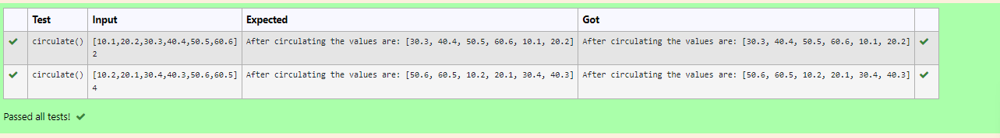

# Circulate-the-values-of-N-variables
## Aim:
To write a python program to circulate the n variables using function concept
## Equipment’s required:
PC
Anaconda - Python 3.7
## Algorithm: 
### Step 1: 
Define a function
### Step 2:
Get the list from the user
### Step 3: 
Get the value from the user for the number of rotation
### Step 4: 
Using the slicing concept rotate the list
### Step 5: 
Print the list after circulating it
### Step 6: 
End the program.
## Program:
```python
#Program to circulate N values.
#Developed by:A.J.PRANAV
#RegisterNumber:22008772
def circulate():
    a=eval(input())
    n=int(input())
    l=a[n:]+a[:n]
    print("After circulating the values are:",l)
```
## Output:

## Result:
Thus the program for circulating n variables was successfully executed.
